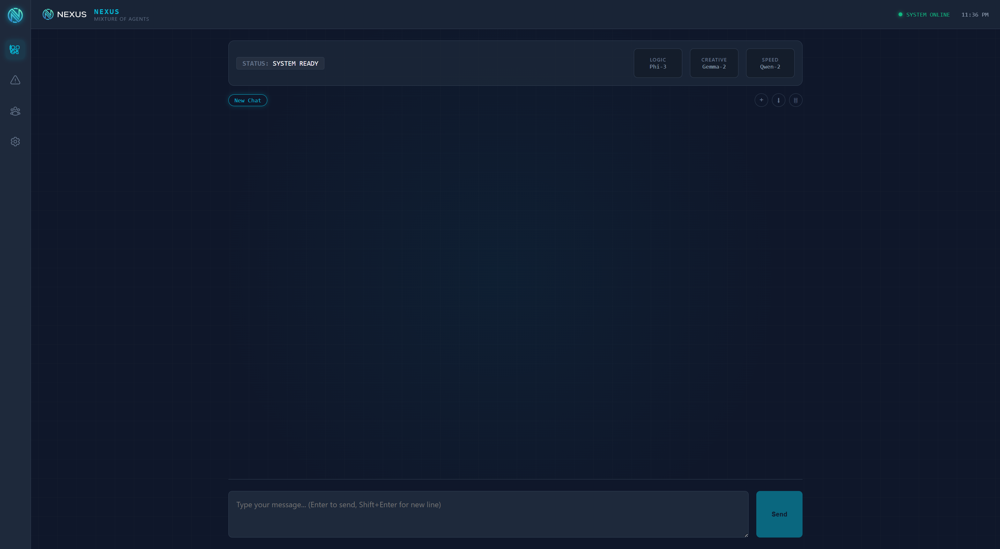
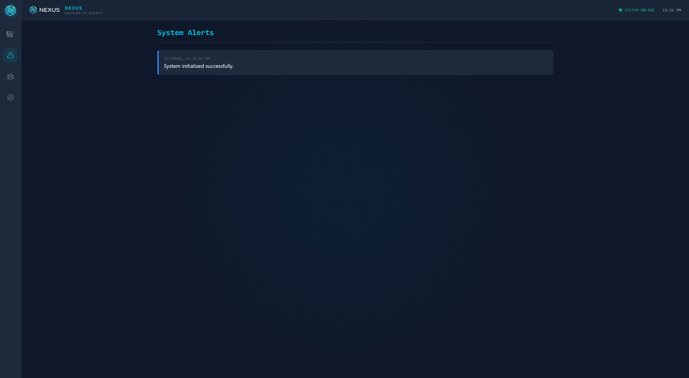
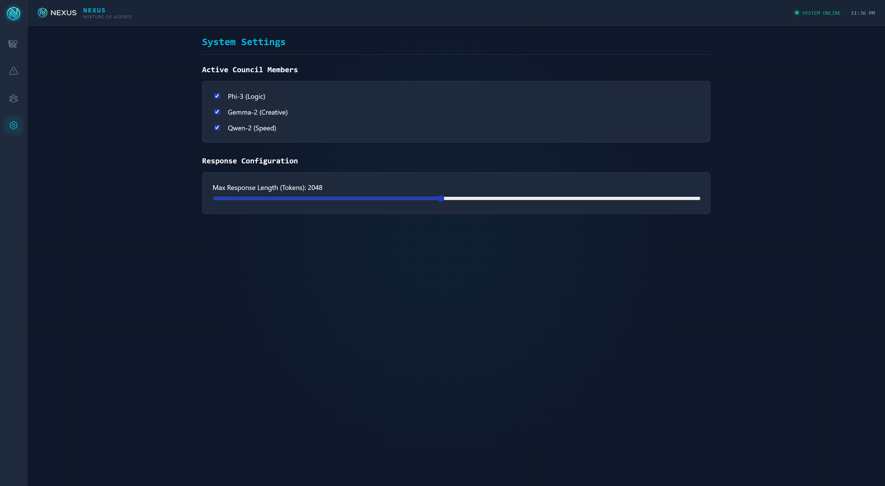
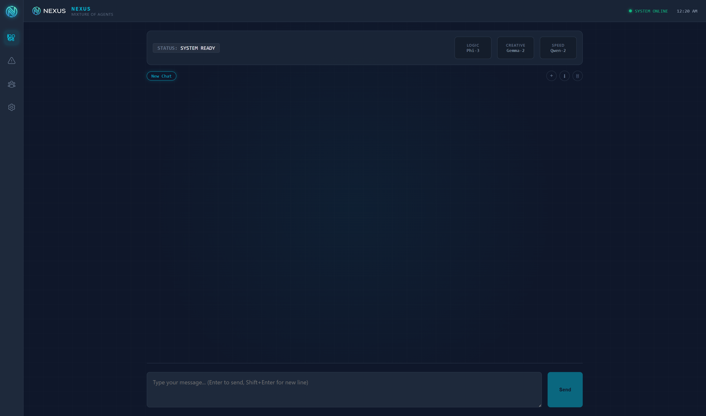
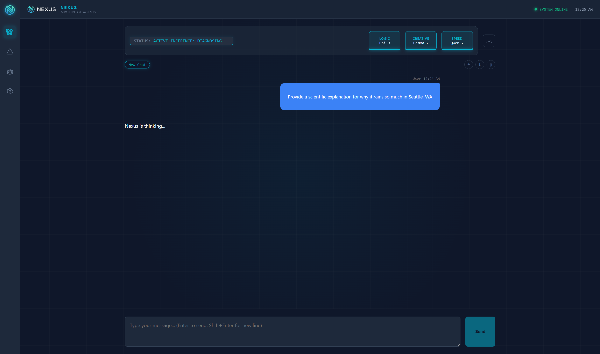
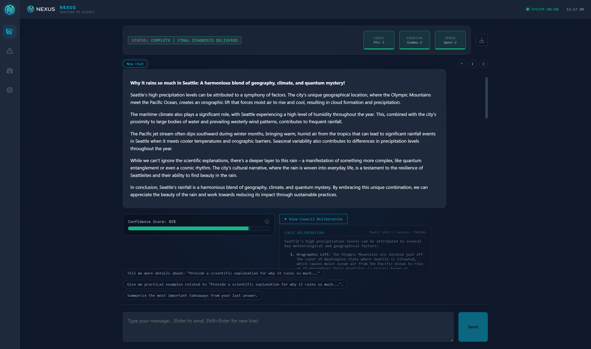
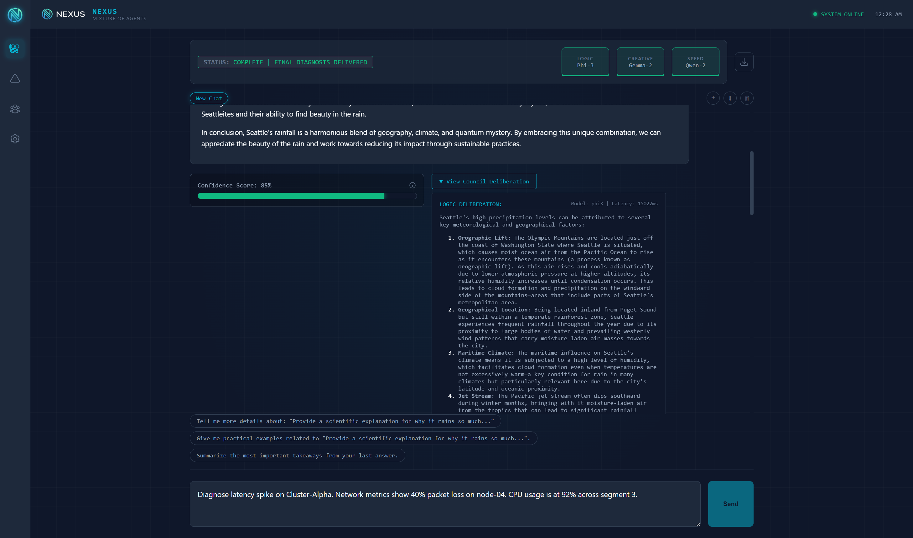

# Nexus: The Resilient AI Consensus Engine


> **A Mixture of Agents (MoA) architecture for Site Reliability Engineering**

Nexus is a self-hosted AI application that provides more reliable answers by leveraging a **council of specialized AI models** working in parallel, rather than relying on a single model. A judge model synthesizes their responses into a single, high-confidence answer with full observability.

---

## Table of Contents

- [Overview](#overview)
- [Key Features](#key-features)
- [Screenshots](#screenshots)
- [Architecture Overview](#architecture-overview)
- [Prerequisites](#prerequisites)
- [Installation](#installation)
- [Configuration](#configuration)
- [Usage](#usage)
- [Project Structure](#project-structure)
- [How It Works](#how-it-works)
- [API Integration](#api-integration)
- [Troubleshooting](#troubleshooting)
- [Use Cases & Examples](#use-cases--examples)
- [Performance & Limitations](#performance--limitations)
- [Development](#development)
- [Roadmap](#roadmap)
- [Contributing](#contributing)
- [Documentation](#documentation)
- [License](#license)
- [Acknowledgments](#acknowledgments)

---

## Overview

**Nexus** implements a **Mixture of Agents (MoA)** architecture where multiple small language models (the "Council") analyze your question in parallel, and a larger "Judge" model synthesizes their responses into a single, coherent answer. This approach provides:

- **Diversity** - Different AI "personalities" (logical, creative, fast) contribute unique perspectives
- **Consensus** - The judge combines the best insights from each council member
- **Reliability** - Circuit breaker patterns ensure graceful degradation if one model fails
- **Observability** - Full visibility into latency, token usage, and confidence scores

Nexus is designed for **Site Reliability Engineers** and **DevOps professionals** who need high-reliability AI assistance without vendor lock-in. It runs entirely on your infrastructure, supports air-gapped deployments, and integrates seamlessly with Open WebUI.

---

## Key Features

- ✅ **Mixture of Agents (MoA) Architecture** - Parallel council execution with judge synthesis
- ✅ **Three Specialized Council Members**:
  - **Phi-3 (Logic)** - Analytical reasoning and structured thinking
  - **Gemma-2 (Creative)** - Lateral thinking and creative problem-solving
  - **Qwen-2 (Speed)** - Fast, practical responses
- ✅ **Llama-3 Judge** - Synthesizes council responses into coherent answers
- ✅ **Circuit Breaker Resilience** - Graceful degradation if models timeout or fail
- ✅ **Confidence Scoring** - 0-100 confidence score based on council consensus
- ✅ **SRE Observability** - Latency metrics, token usage, and performance telemetry
- ✅ **Self-Hosted & Air-Gapped** - Runs entirely on your infrastructure
- ✅ **Beautiful UI** - Minimalist neo-future design optimized for readability
- ✅ **Open WebUI Integration** - No forking required; uses pipeline architecture

---

## Screenshots

### Dashboard (Main Chat Interface)

The main dashboard shows the NEXUS branding, system status, and the Council header displaying the three active agents (Phi-3, Gemma-2, Qwen-2). After sending a query, you'll see the judge's synthesized response along with confidence metrics, council deliberation, and SRE terminal logs.



### Alerts View

Monitor system alerts and notifications in real-time.



### Agents View

View information about the council agents and their roles.



### Settings View

Configure which agents are enabled and adjust response parameters like max tokens.


---

## Architecture Overview

Nexus consists of four main components:

| Component | Description |
|-----------|-------------|
| **Nexus React App** | The chat UI you see in the browser. Displays messages, council status, confidence meter, deliberation, and SRE terminal. Communicates with Open WebUI's API. |
| **Open WebUI** | The host application providing the API, authentication, and pipeline execution environment. Nexus extends Open WebUI without modifying its source code. |
| **Nexus Pipeline (Python)** | Custom logic that runs inside Open WebUI's pipeline system. Receives user messages, dispatches to council models in parallel, calls the judge for synthesis, and returns structured responses. |
| **Ollama** | Local inference engine that runs the AI models (Phi-3, Gemma-2, Qwen-2, Llama-3) on your machine. No cloud required. |

### Request Flow

1. **User sends message** → Nexus React App
2. **App calls Open WebUI API** → With "Nexus MoA" model selected
3. **Open WebUI routes to Nexus Pipeline** → Pipeline receives the message
4. **Pipeline dispatches to Council** → Three models answer in parallel:
   - Phi-3 (Logic) - Analytical perspective
   - Gemma-2 (Creative) - Creative perspective  
   - Qwen-2 (Speed) - Fast perspective
5. **Circuit Breaker** → If any model times out, it's skipped (graceful degradation)
6. **Judge Synthesis** → Llama-3 reads all council responses and synthesizes one answer
7. **Response Formatting** → Pipeline returns JSON with answer, confidence, council details, and metrics
8. **UI Rendering** → React app displays judge's answer, confidence meter, council deliberation, and SRE terminal

---

## Prerequisites

### Hardware Requirements

- **GPU**: NVIDIA GPU with 8GB+ VRAM recommended (tested on RTX 2080 Max-Q)
- **RAM**: 16GB+ system RAM
- **Storage**: ~20GB free space for models

### Software Requirements

- **Docker** - For running Open WebUI and Pipelines containers
- **Ollama** - Local AI model runtime ([Download](https://ollama.ai))
- **Node.js 18+** - For the Nexus React app
- **Python 3.11+** - For the pipeline (usually provided by Open WebUI container)

### Required AI Models

Pull these models using Ollama:

```bash
# Council Members (Small Language Models)
ollama pull phi3           # Logic Core - 3.8B parameters
ollama pull gemma2:2b      # Creative Core - 2B parameters  
ollama pull qwen2:1.5b     # Speed Core - 1.5B parameters

# Judge (Synthesizer)
ollama pull llama3         # Judge - 8B parameters
```

**Total VRAM Usage**: ~6-7GB with all models loaded

---

## Installation

### Step 1: Install Ollama

Download and install Ollama from [ollama.ai](https://ollama.ai), then verify it's running:

```bash
curl http://localhost:11434/api/tags
```

### Step 2: Pull Required Models

```bash
ollama pull phi3
ollama pull gemma2:2b
ollama pull qwen2:1.5b
ollama pull llama3
```

### Step 3: Set Up Open WebUI

Run Open WebUI using Docker:

```bash
docker run -d -p 3000:8080 \
  --add-host=host.docker.internal:host-gateway \
  -v open-webui:/app/backend/data \
  --name open-webui \
  --restart always \
  ghcr.io/open-webui/open-webui:main
```

### Step 4: Install Nexus Pipeline

#### Option A: Direct Pipeline Installation

1. Copy the pipeline file to Open WebUI's pipelines directory:

```bash
# Linux/macOS
cp pipelines/nexus_moa.py ~/.local/share/open-webui/pipelines/

# Windows (Docker)
docker cp pipelines/nexus_moa.py open-webui:/app/pipelines/
```

2. Install Python dependencies:

```bash
pip install -r requirements.txt
```

3. Restart Open WebUI:

```bash
docker restart open-webui
```

#### Option B: Using Pipelines Container (Recommended for Production)

1. Start the Pipelines container:

```bash
docker run -d -p 9099:9099 \
  --add-host=host.docker.internal:host-gateway \
  -v ./pipelines:/app/pipelines \
  --name pipelines \
  --restart always \
  ghcr.io/open-webui/pipelines:main
```

2. Copy the pipeline file:

```bash
cp pipelines/nexus_moa.py ./pipelines/
```

3. Connect in Open WebUI Admin Panel:
   - Go to **Admin Panel** → **Settings** → **Connections**
   - Add connection: `http://host.docker.internal:9099`
   - Restart Open WebUI

### Step 5: Set Up Nexus React App

1. Navigate to the app directory:

```bash
cd nexus-app
```

2. Install dependencies:

```bash
npm install
```

3. Configure environment variables:

Create a `.env` file:

```env
VITE_OPEN_WEBUI_URL=http://localhost:3000
VITE_OPEN_WEBUI_API_KEY=your_api_key_here
VITE_NEXUS_MODEL=Nexus MoA
```

**Getting Your API Key:**
- Open Open WebUI at `http://localhost:3000`
- Go to **Settings** → **Account**
- Copy your API key

4. Start the development server:

```bash
npm run dev
```

The app will be available at `http://localhost:5173`

### Step 6: Verify Installation

1. In Open WebUI, go to **Admin Panel** → **Settings** → **Pipelines**
2. You should see **"Nexus MoA"** in the pipeline list
3. In the Nexus app, send a test message to verify the pipeline is working

---

## Configuration

### Pipeline Valves (Open WebUI Admin Panel)

Configure the Nexus pipeline in **Admin Panel** → **Settings** → **Pipelines** → **Nexus MoA**:

| Valve | Default | Description |
|-------|---------|-------------|
| `ollama_base_url` | `http://host.docker.internal:11434` | Ollama API endpoint |
| `logic_model` | `phi3` | Logic Core model name |
| `creative_model` | `gemma2:2b` | Creative Core model name |
| `speed_model` | `qwen2:1.5b` | Speed Core model name |
| `judge_model` | `llama3` | Judge/Synthesizer model name |
| `logic_temperature` | `0.3` | Lower = more focused (0.0-2.0) |
| `creative_temperature` | `0.7` | Higher = more creative (0.0-2.0) |
| `speed_temperature` | `0.5` | Balanced (0.0-2.0) |
| `judge_temperature` | `0.4` | Balanced synthesis (0.0-2.0) |
| `circuit_breaker_timeout` | `120.0` | Seconds before circuit breaker trips |
| `max_council_tokens` | `512` | Max tokens per council response |
| `max_judge_tokens` | `1024` | Max tokens for judge synthesis |
| `show_deliberation` | `true` | Show council deliberation panel |
| `show_terminal` | `true` | Show SRE observability terminal |

### Environment Variables (Alternative)

You can also configure via environment variables:

```bash
export OLLAMA_BASE_URL="http://localhost:11434"
export NEXUS_LOGIC_MODEL="phi3"
export NEXUS_CREATIVE_MODEL="gemma2:2b"
export NEXUS_SPEED_MODEL="qwen2:1.5b"
export NEXUS_JUDGE_MODEL="llama3"
export NEXUS_TIMEOUT="120.0"
```

### Nexus App Settings

In the Nexus app Settings view, you can:

- **Toggle agents**: Enable/disable Phi-3, Gemma-2, or Qwen-2
- **Adjust max tokens**: Set maximum response length (default: 2048)

Settings are stored in browser localStorage and sent with each request.

---

## Usage

### Starting the Services

1. **Start Ollama** (if not running as a service):
   ```bash
   ollama serve
   ```

2. **Start Open WebUI** (if using Docker):
   ```bash
   docker start open-webui
   ```

3. **Start Nexus App**:
   ```bash
   cd nexus-app
   npm run dev
   ```

### Sending Your First Query

1. Open the Nexus app at `http://localhost:5173`
2. Enter your API key if prompted (first launch)
3. Type a message in the input field
4. Press Enter or click Send
5. Watch the Council header show active inference status
6. View the judge's synthesized response
7. Expand **Council Deliberation** to see individual agent responses
8. Expand **SRE Terminal** to view latency and token metrics

### Understanding the Response

Each response includes:

- **Judge's Answer** - The synthesized, final response
- **Confidence Score** - 0-100% indicating council consensus
- **Council Deliberation** (expandable) - Individual responses from Phi-3, Gemma-2, and Qwen-2
- **SRE Terminal** (expandable) - Latency metrics, token usage, and circuit breaker status

---

## Project Structure

```
Nexus/
├── docs/                          # Documentation
│   ├── screenshots/              # UI screenshots
│   ├── INSTALLATION.md           # Detailed installation guide
│   ├── NEXUS_APP_SETUP.md        # React app setup guide
│   └── PROJECT_OVERVIEW.md       # Comprehensive project overview
├── nexus-app/                    # React frontend application
│   ├── src/
│   │   ├── components/          # React components
│   │   │   ├── ChatInterface.tsx
│   │   │   ├── Council/         # Council-specific components
│   │   │   ├── Layout/          # Dashboard layout
│   │   │   ├── SRE/             # SRE terminal component
│   │   │   └── Views/           # Alerts, Agents, Settings views
│   │   ├── services/            # API integration
│   │   ├── styles/              # CSS stylesheets
│   │   └── types/               # TypeScript types
│   └── package.json
├── pipelines/                    # Open WebUI pipeline
│   ├── nexus_moa.py             # Main pipeline logic
│   └── nexus_moa/
│       └── valves.json          # Default valve configuration
├── scripts/                      # Setup and troubleshooting scripts
│   ├── setup_nexus.ps1
│   ├── fix_pipeline_connection.ps1
│   └── troubleshoot_pipeline.ps1
├── requirements.txt              # Python dependencies
└── README.md                     # This file
```

---

## How It Works

### Detailed Request Flow

1. **User Input**: Message typed in Nexus React app
2. **API Call**: App sends POST request to Open WebUI `/api/chat/completions` with:
   - Model: "Nexus MoA"
   - Messages: Conversation history + new message
   - Nexus settings: Enabled agents, max tokens
3. **Pipeline Inlet**: Nexus pipeline receives request, adds metadata
4. **Council Dispatch**: Pipeline sends user prompt to three models **in parallel**:
   - Each model gets a role-specific prompt (Logic/Creative/Speed)
   - All three requests execute simultaneously (asyncio.gather)
   - Each has a timeout (circuit breaker)
5. **Circuit Breaker**: If a model exceeds timeout:
   - That model's result is marked as "timeout" or "error"
   - System continues with remaining successful responses
   - Circuit state changes to "OPEN" for that model
6. **Judge Synthesis**: All council responses (successful + errors) are sent to Llama-3:
   - Judge receives original question + all council responses
   - Judge synthesizes into one coherent answer
   - Judge calculates confidence score (0-100)
   - Judge returns JSON with response and confidence
7. **Response Formatting**: Pipeline builds structured JSON:
   - Judge's answer
   - Confidence score
   - Council results (model, role, response, latency, tokens, status)
   - SRE logs (formatted telemetry)
8. **UI Rendering**: React app receives JSON and displays:
   - Judge's answer (markdown rendered)
   - Confidence meter (visual progress bar)
   - Council deliberation (expandable cards)
   - SRE terminal (expandable log view)

### Circuit Breaker Logic

- **CLOSED (STABLE)**: Model responding normally
- **OPEN (TRIPPED)**: Model timed out or errored
- **HALF_OPEN (TESTING)**: Recovery attempt (future feature)

If all three council members fail, the judge still receives the error information and can provide a degraded response.

### Confidence Scoring

Current implementation:
- Base confidence = (successful responses / total council members)
- Bonus: +0.1 if all members succeeded
- Future: Semantic similarity between responses

---

## API Integration

### Open WebUI API Usage

The Nexus React app uses Open WebUI's Chat Completions API:

```typescript
POST http://localhost:3000/api/chat/completions
Authorization: Bearer YOUR_API_KEY
Content-Type: application/json

{
  "model": "Nexus MoA",
  "messages": [
    { "role": "user", "content": "Your question here" }
  ],
  "nexus_settings": {
    "enabledAgents": {
      "phi3": true,
      "gemma2": true,
      "qwen2": true
    },
    "maxTokens": 2048
  }
}
```

### Response Format

```json
{
  "choices": [{
    "message": {
      "content": "{\"type\":\"nexus_moa_response\",\"content\":\"...\",\"confidence\":85,\"council_results\":[...],\"sre_logs\":[...]}"
    }
  }]
}
```

The `content` field contains a JSON string with:
- `type`: "nexus_moa_response"
- `content`: Judge's synthesized answer
- `confidence`: 0-100 confidence score
- `council_results`: Array of council member responses
- `sre_logs`: Array of formatted telemetry logs

---

## Troubleshooting

### Pipeline Not Appearing

**Check pipeline file location:**
```bash
# Docker
docker exec open-webui ls -la /app/pipelines/nexus_moa.py

# Local
ls -la ~/.local/share/open-webui/pipelines/nexus_moa.py
```

**Check Open WebUI logs:**
```bash
docker logs open-webui 2>&1 | grep -i pipeline
```

**Solution**: Copy pipeline file to correct location and restart Open WebUI.

### Ollama Connection Errors

**Verify Ollama is running:**
```bash
curl http://localhost:11434/api/tags
```

**Check Docker networking:**
```bash
# From Open WebUI container
docker exec open-webui curl http://host.docker.internal:11434/api/tags
```

**Solution**: Ensure `host.docker.internal` is configured or use host IP directly in `ollama_base_url` valve.

### Models Timing Out

**Symptoms**: Circuit breaker trips, responses incomplete

**Solutions**:
- Increase `circuit_breaker_timeout` in pipeline valves (default: 120s)
- Check GPU memory: `nvidia-smi`
- Verify models are loaded: `ollama ps`
- Reduce `max_council_tokens` or `max_judge_tokens`

### UI Not Loading

**Check Nexus app is running:**
```bash
cd nexus-app
npm run dev
```

**Verify API key:**
- Check `.env` file has correct `VITE_OPEN_WEBUI_API_KEY`
- Verify API key in Open WebUI Settings → Account

**Check CORS:**
- Ensure Open WebUI allows requests from `http://localhost:5173`
- Should work by default for localhost

### Additional Resources

- [Detailed Installation Guide](docs/INSTALLATION.md)
- [Nexus App Setup](docs/NEXUS_APP_SETUP.md)
- [Troubleshooting Guide](docs/TROUBLESHOOTING_404.md)
- [Pipeline Connection Fix](docs/ENABLE_NEXUS_PIPELINE.md)

---

## Use Cases & Examples

### Example 1: Scientific Explanation

**Prompt**: "Provide a scientific explanation for why it rains so much in Seattle, WA."



**What Happens**:
- **Phi-3 (Logic)** focuses on meteorological data, pressure systems, and geographic factors
- **Gemma-2 (Creative)** explores unique angles like microclimates and seasonal patterns
- **Qwen-2 (Speed)** provides quick, practical facts about precipitation statistics
- **Llama-3 (Judge)** synthesizes all three perspectives into a comprehensive explanation with confidence score

**Expected Output**: A well-rounded answer covering:
- Geographic factors (Puget Sound, Olympic Mountains)
- Weather patterns (Pacific storms, convergence zones)
- Statistical data (annual rainfall, seasonal distribution)
- Confidence score indicating how well the council agreed

**Response Screenshot**: The complete response showing the judge's synthesized answer, confidence score (85%), and SRE terminal with council metrics:



**Council Deliberation Expanded**: Clicking "View Council Deliberation" reveals each agent's individual response:



The response includes:
- The judge's synthesized answer displayed prominently
- A confidence meter (progress bar) showing 85% consensus score
- An expandable "Council Deliberation" section showing each agent's individual response:
  - **LOGIC DELIBERATION** (Phi-3) - Analytical perspective with detailed meteorological factors
  - **CREATIVE DELIBERATION** (Gemma-2) - Creative angles and unique insights
  - **SPEED DELIBERATION** (Qwen-2) - Quick practical facts
- An expandable "SRE Terminal" showing latency metrics and token usage for each model:
  - Phi-3: 15022ms, 34 t/s
  - Gemma-2: 33648ms, 15 t/s
  - Qwen-2: 17505ms, 17 t/s

### Example 2: SRE Diagnostics

**Prompt**: "Diagnose latency spike on Cluster-Alpha. Network metrics show 40% packet loss on node-04. CPU usage is at 92% across segment 3."

**What Happens**:
- **Phi-3** provides structured analysis: likely causes, evidence, and logical reasoning
- **Gemma-2** suggests creative troubleshooting approaches and alternative hypotheses
- **Qwen-2** quickly identifies the most actionable steps
- **Judge** synthesizes into a prioritized diagnosis with recommended actions

**Visual Result**: The response displays:
- Judge's prioritized diagnosis with root cause analysis
- Confidence score based on council consensus
- Council deliberation showing each agent's diagnostic approach
- SRE terminal logs showing model latencies and token usage for each council member



### Example 3: Technical Decision Support

**Prompt**: "Compare three caching strategies: Redis, Memcached, and in-memory. Which is best for a high-traffic API?"

**What Happens**:
- Each council member evaluates from their perspective (analytical, creative, practical)
- Judge provides balanced comparison with trade-offs
- Confidence score reflects how much the council agreed on recommendations

**Visual Result**: The response shows:
- Judge's comprehensive comparison with pros/cons for each strategy
- Confidence meter indicating how strongly the council agreed
- Council deliberation revealing each agent's reasoning (Phi-3's analytical breakdown, Gemma-2's creative alternatives, Qwen-2's practical recommendations)

### Example 4: Learning & Education

**Prompt**: "Explain how circuit breakers work in distributed systems and how they're implemented in this pipeline."

**What Happens**:
- Council provides multiple explanations (theoretical, practical, implementation-focused)
- Judge creates a comprehensive explanation suitable for learning
- SRE terminal shows actual circuit breaker behavior in real-time

**Visual Result**: The response includes:
- Judge's educational explanation combining theory and practice
- Council deliberation showing different teaching approaches (Phi-3's structured theory, Gemma-2's analogies, Qwen-2's quick reference)
- SRE terminal displaying actual circuit breaker states (CLOSED/OPEN) from the current query execution

---

## Performance & Limitations

### Performance Metrics

- **Typical Response Time**: 15-30 seconds (depends on prompt complexity and hardware)
- **VRAM Usage**: ~6-7GB with all models loaded
- **CPU Usage**: Moderate (models run on GPU when available)
- **Memory**: ~2-3GB system RAM for pipeline and app

### Limitations

- **Model Size**: Optimized for 8GB VRAM; larger models may require more GPU memory
- **Response Time**: Parallel execution helps, but still slower than single-model systems
- **Token Limits**: Council responses limited to 512 tokens each; judge limited to 1024 tokens (configurable)
- **Confidence Scoring**: Currently based on success rate; semantic similarity not yet implemented
- **Streaming**: Not yet supported; responses arrive after full synthesis

### Optimization Tips

- **Disable unused agents**: Turn off Gemma-2 or Qwen-2 if you only need logical analysis
- **Reduce token limits**: Lower `max_council_tokens` for faster responses
- **Adjust timeouts**: Increase `circuit_breaker_timeout` for slower hardware
- **GPU optimization**: Ensure CUDA/ROCm is properly configured for Ollama

---

## Development

### Development Setup

1. **Clone the repository**:
   ```bash
   git clone <repository-url>
   cd Nexus
   ```

2. **Set up Python environment** (for pipeline development):
   ```bash
   python -m venv venv
   source venv/bin/activate  # Windows: venv\Scripts\activate
   pip install -r requirements.txt
   ```

3. **Set up Node.js environment** (for React app):
   ```bash
   cd nexus-app
   npm install
   ```

### Running in Development Mode

**Pipeline Development**:
- Edit `pipelines/nexus_moa.py`
- Restart Open WebUI to reload pipeline
- Check logs: `docker logs open-webui`

**React App Development**:
```bash
cd nexus-app
npm run dev
```
- Hot module replacement enabled
- Changes reflect immediately in browser

### Making Changes

**Pipeline Changes**:
1. Edit `pipelines/nexus_moa.py`
2. Copy to Open WebUI pipelines directory
3. Restart Open WebUI

**UI Changes**:
1. Edit files in `nexus-app/src/`
2. Changes auto-reload in dev mode
3. Build for production: `npm run build`

### Testing

- **Manual Testing**: Use the Nexus app to send test queries
- **Pipeline Testing**: Check Open WebUI logs for errors
- **API Testing**: Use curl or Postman to test Open WebUI API directly

---

## Roadmap

### Planned Improvements

- **Semantic Confidence Scoring** - Use similarity metrics between council responses for more accurate confidence scores
- **Streaming Responses** - Stream judge's reply (and optionally council replies) as they're generated
- **Persistent Observability** - Store metrics in database for trend analysis and dashboards
- **Configurable Council** - Add/remove council members via admin panel without code changes
- **Response Caching** - Cache responses for repeated queries to reduce latency
- **Enhanced Error Handling** - Better user-facing error messages and automatic retries
- **Multi-Tenancy** - Support for multiple teams with usage limits and rate limiting
- **Real-Time Alerts** - Connect Alerts view to actual pipeline events (circuit breaker trips, timeouts)
- **Export & Audit** - Export chat history and metrics for compliance and cost tracking

### Future Enhancements

- **Domain-Specific Councils** - Pre-configured councils for security, networking, or custom domains
- **Model Fine-Tuning** - Support for fine-tuned models optimized for specific tasks
- **Multi-Region Support** - Route council members to different Ollama instances for redundancy
- **Advanced Observability** - Integration with Prometheus, Grafana, or other monitoring tools

---

## Contributing

Contributions are welcome! Here's how you can help:

1. **Fork the repository**
2. **Create a feature branch**: `git checkout -b feature/amazing-feature`
3. **Make your changes**
4. **Test thoroughly**
5. **Commit your changes**: `git commit -m 'Add amazing feature'`
6. **Push to the branch**: `git push origin feature/amazing-feature`
7. **Open a Pull Request**

### Code Style

- **Python**: Follow PEP 8, use type hints
- **TypeScript/React**: Use ESLint and Prettier configurations
- **Documentation**: Update README and docs for new features

### Reporting Issues

Please use GitHub Issues to report bugs or suggest features. Include:
- Description of the issue
- Steps to reproduce
- Expected vs. actual behavior
- System information (OS, GPU, Docker version, etc.)

---

## Documentation

Comprehensive documentation is available in the `docs/` directory:

- **[PROJECT_OVERVIEW.md](docs/PROJECT_OVERVIEW.md)** - Detailed project explanation for laymen
- **[INSTALLATION.md](docs/INSTALLATION.md)** - Step-by-step installation guide
- **[NEXUS_APP_SETUP.md](docs/NEXUS_APP_SETUP.md)** - React app setup and configuration
- **[ENABLE_NEXUS_PIPELINE.md](docs/ENABLE_NEXUS_PIPELINE.md)** - Pipeline connection troubleshooting
- **[TROUBLESHOOTING_404.md](docs/TROUBLESHOOTING_404.md)** - Common issues and solutions

---

## License

This project is part of the Nexus SRE Portfolio Project. See LICENSE file for details.

---

## Acknowledgments

Nexus is built on top of excellent open-source projects:

- **[Open WebUI](https://github.com/open-webui/open-webui)** - The host platform providing API and pipeline infrastructure
- **[Ollama](https://ollama.ai)** - Local AI model runtime
- **AI Model Creators**:
  - **Microsoft Phi-3** - Logic Core model
  - **Google Gemma-2** - Creative Core model
  - **Alibaba Qwen-2** - Speed Core model
  - **Meta Llama-3** - Judge/Synthesizer model

Special thanks to the open-source community for making self-hosted AI accessible and powerful.

---

**Built with ❤️ for the SRE community**
